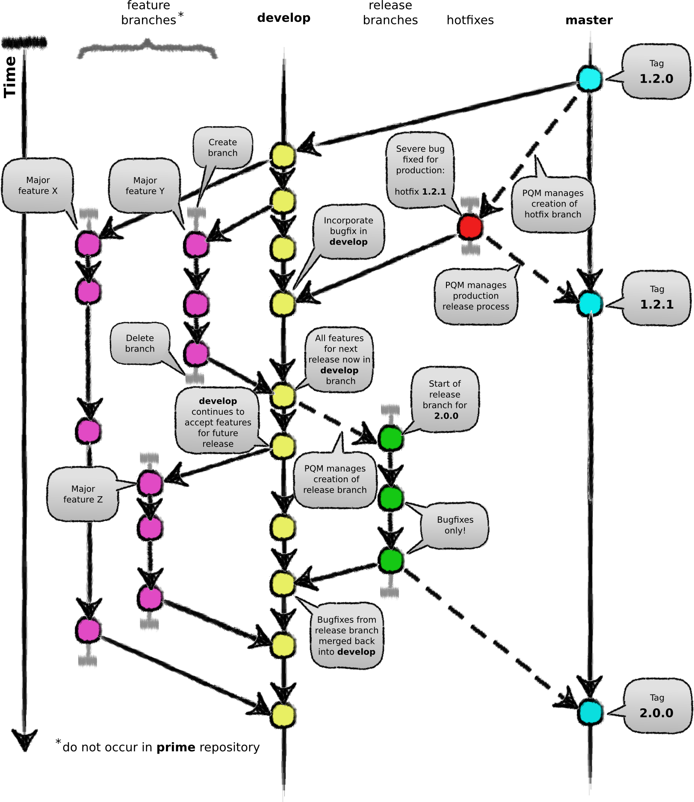

.. _Development code structure for MAP Client:

==============
Code Structure
==============

This section describes the code structure for MAP Client.

.. contents::

Overview
========

The code is structured into five broad sections:

* Core
* Mount points
* Settings
* Tools
* View

The *core* section contains the model information, the *view* section provides the user interface for the model.  The
*settings* section contains all the settings and options for the application.  The *tools* section contains tools that
are useful to MAP Client operations but not required for the core functionality of the program.  The *mount points*
section defines the interface for plugins and the plugin framework

Core
====

The *core* is sub-sectioned into a *managers* package and the *main application*.  The *main application* contains all
the managers which hold all the model information.

View
====

The *view* package provides the user interface to the model information held by the *core* package.

.. note::

 - This shouldn't be a problem.

