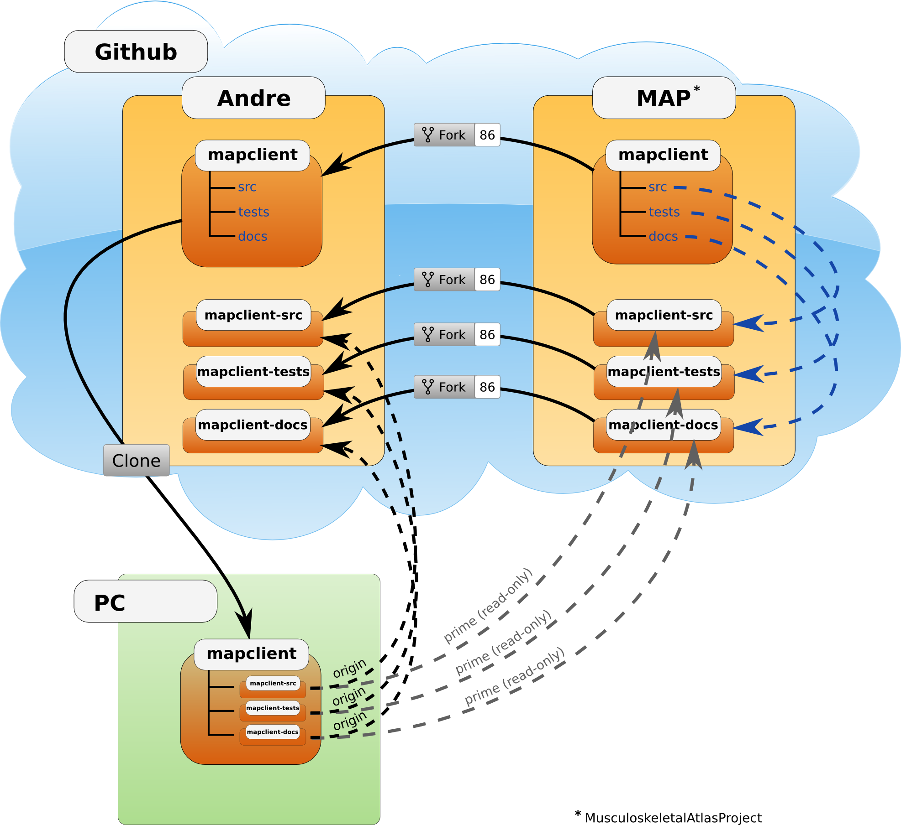

.. _Developer Setup for MAP Client:

=================
Development Setup
=================

This section describes how someone wanting to contribute to the MAP Client project should set up their *working copy* for developing MAP Client.

.. contents::

Overview
========

MAP Client makes use of Git.  Development setup requires a fairly minimal amount of work consistent with other Python based application projects.

#. Github user account (for the rest of this document we will call our user *andre*)
#. Git installed and available from the command line

This document doesn't cover the process of satisfying these prerequisites, it is left as an exercise for you (Google is your friend).  The remainder of this document assumes that these prerequisites have been met.

The goal here is to get a working copy of source code, tests, and documentation onto your PC so that you can begin development.  To make this happen you will need to fork the prime MAP Client repository, make a clone onto your PC, initialise the submodules, and set up the Git remotes.  In **Figure 1** you can see a pictorial representation of what you are aiming to achieve. 

   
   **Figure 1**: Setup of repositories for development

The four steps to getting set up are detailed below.

Forking your own copy
=====================

For contributors you need to fork the **prime** repository:

#. *mapclient*

Login to Github with your username and go to::

        https://github.com/MusculoskeletalAtlasProject

and fork the *mapclient* repository into your own Github user account.

Clone
=====

You now need to clone the mapclient repository to your PC.  You do this by going to your fork (in this example user andre's fork) at:

https://github.com/andre/mapclient

**Note**: Don't try and clone this location substitute your Github username for *andre*.

On the right hand side of the webpage on your fork of the repository you can get the link for cloning the repository to your PC, in our example::

        https://github.com/andre/mapclient.git

Now clone the repository::

        cd /somewhere/you/keep/development/code
        git clone https://github.com/andre/mapclient.git

Note: Again, don't and clone this location substitute your username for *andre*.

Set Git remotes
===============

You now need to setup a read-only remote connection to the prime repository.  Given that you are still in the *mapclient* directory where you cloned the repository, do the following::

	cd mapclient
	git remote add prime https://github.com/MusculoskeletalAtlasProject/mapclient
	git config remote.prime.pushurl "you really didn't want to do that"

You have now added a new remote named **prime** and set origin as the default fetch and push location to point at a repository under your control on Github.  Here **prime** is a reference to the main definitive repository where releases are made from for the MAP Client project.  You have also set the **prime** repository as read-only by setting an invalid push url.

Finally
=======

You are all done and ready to start development, read :doc:`Contributing <MAP-development-contribution>` on how to get your changes into mapclient's repository.
