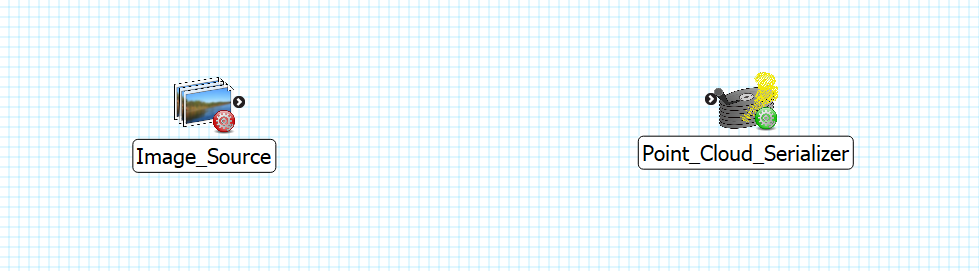
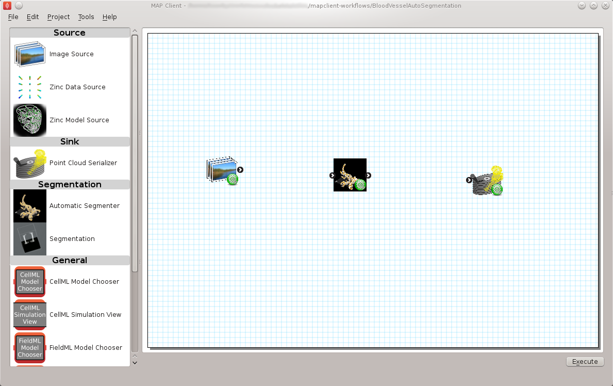
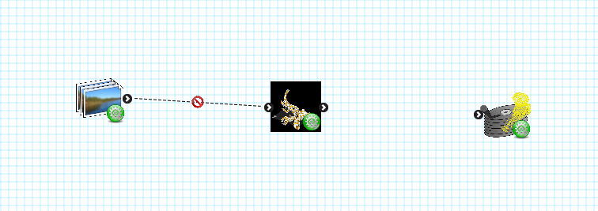
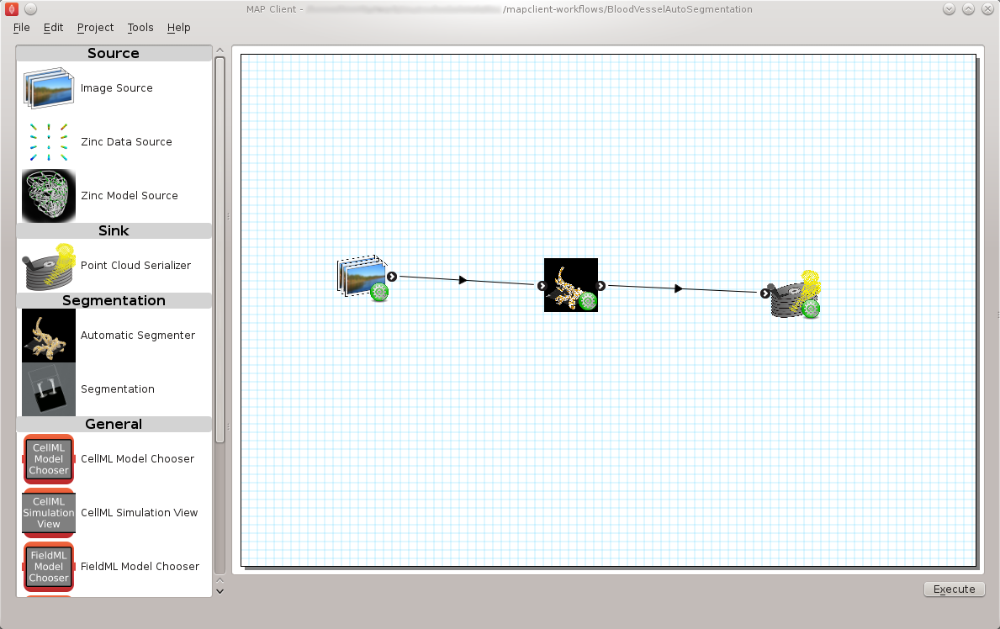
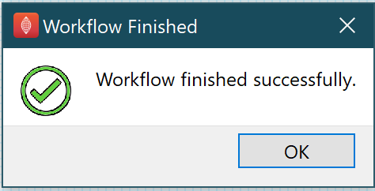

===============
Create Workflow
===============

.. sectionauthor:: Hugh Sorby

.. _launchpad project: http://launchpad.net/mapclient
.. _MAP: https://simtk.org/home/map

.. note::
   `MAP`_ is currently under active development, and this document will be updated to reflect any changes to the software or new features that are added.

Create New Workflow
-------------------

To get started with MAP we need to create a new workflow.  To do this we use :menuselection:`File --> New --> Workflow` menu option (:kbd:`Ctrl-N` shortcut).  
This option will present the user with a directory selection dialog. 
Use the dialog to select a directory where the workflow can be saved.  

To create a meaningful workflow, we need to use some external plugins. 
If you installed MAP Client using :ref:`Pre-Built Binary <MAP-Pre-Built-Install>` plugins are already embedded. 
Otherwise, you need to :ref:`install some plugins <MAP-install-setup>` first.

Place Plugins
-------------
To place plugins we use Drag 'n' Drop to drag steps from the Step box and drop the step onto the workflow canvas.  
When steps are first dropped onto the canvas they show a red gear icon to indicate that the step is not configured.  

   The left plugin is not configured and has a red gear; the right one does not need to be configured and has a green gear.
 

Configuring Plugins
-------------------
To configure a step we can either right click on the step to bring up a context menu from which the configure action can be chosen or simply click the red gear directly.  
See the relevant section for the configuration of a particular step.

   Plugins all configured.

After configured, the gear will turn green.

.. note::
  When configuring a step you are asked to set an identifier.  The identifier you set must unique within the workflow and it must not start with a '.'.

Link Plugins
------------
Once the All the steps in the workflow are configured (i.e. no more red gear icons) we can make connections between the steps.  
To make a connection between two steps the first step must provide what the second step uses.
If the mouse is hovered over a port you will see a description of what the port provides or uses.  
To make a connection click on a port and drag the mouse to the port to be connected. 

.. figure:: images/step_with_port_info_displayed_1.png
   :align: center
   :width: 50%

   Provide port description.
  
When trying to connect two steps that cannot be connected you will see a no entry icon over the connection for a short period of time and then the connection will be removed.  
The following image shows an incorrect connection trying to be made.

   Error connection.

The workflow should be connected up as can be seen in the following image.

   Connected plugins

.. note::
  We can make connections between steps at anytime not just when all steps have been properly configured.

Executing the Workflow
----------------------
To execute the workflow we need to connect up the steps in the correct manner and save (:kbd:`Ctrl-S` shortcut) the workflow.
If you didn't `Create New Workflow`_ before `Place Plugins`_, a directory selection dialog will be presented to select a directory where the workflow can be saved.  

Clicking the execute button will, naturally enough, execute the workflow step by step. 
You will see the following dialog if the workflow finished successfully.

   Workflow finished dialog.

Additional Resources
--------------------
:ref:`MAP Features Demonstration <MAP-feature-demonstration>`

   This document cover the features of the MAP Client.

:ref:`MAP Tutorial - Create Workflow <MAP-tutorial-create>`

   This document details takes the reader through the process of creating a workflow from existing MAP plugins.
