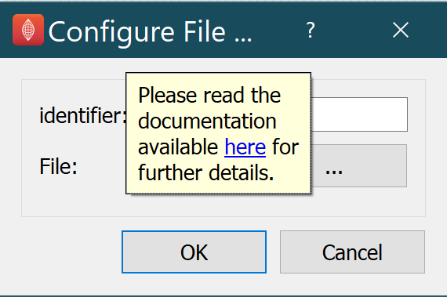

===========
Help System
===========

ABI Mapping tool has a range of built-in and web-based help options.

Tooltips
--------

When hovering the mouse cursor over a button or setting, after a few instants a tooltip appears.

What's this
-----------

Every plugin has a link to their online documentation at configure dialog.

