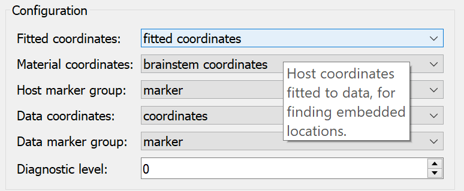

===========
Help System
===========

ABI Mapping tool has a range of built-in and web-based help options.

What's this
-----------

Every plugin has a link to their online documentation at configure dialog. Clicking the question mark and then click anywhere on config dialog will see it.

.. figure:: images/help_whatsthis.png
   :align: center
   :width: 40%

   Link to online documentation.

Tooltips
--------

When hovering the mouse cursor over a button or setting, after a few instants a tooltip appears.

   Tooltip of the Fitted coordinates in the Data Embedder.

GitHub Issues
-------------

If you have any question or feedback can put an issue on the `GitHub repository <https://github.com/ABI-Tutorials/ABI-MappingTools/issues>`_.

Contact the author
------------------

Hugh Sorby <h.sorby@auckland.ac.nz>