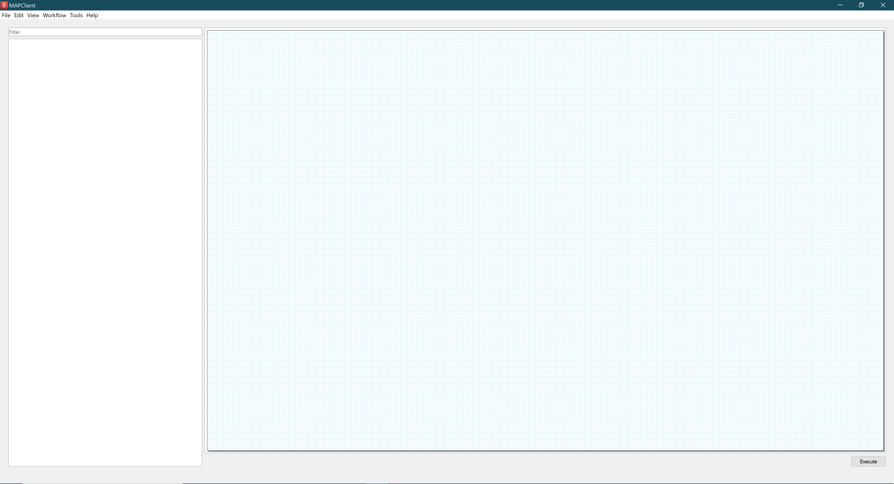

==================
Install MAP Client
==================

The MAP Client software is a Python application that uses the PySide2 Qt library bindings.

There are three main ways of getting the MAP Client installed on your operating system.

For people who are only running existing workflows the suggested installation method is `Install Using Pre-Built Binary`_.

For plugin developers the suggested method is to `Install Using Pip`_ or `Install Using Git`_.

The MAP Client relies heavily on plugins to do anything interesting.
If you `Install Using Pre-Built Binary`_ you get everything you need, however you can only use plugins that have all the dependencies already available to the binary. At this time you cannot add dependencies that a new plugin may or may not require to work.
If you `Install Using Pip`_ or `Install Using Git`_, you can either create these yourself or add already available ones to your application by downloading them and using the Plugin Manager Tool in the MAP Client, read the documents :ref:`MAP-feature-demonstration` and :ref:`MAP-plugin-wizard` to learn more.

------------
Installation
------------

.. _MAP-Pre-Built-Install:

Install Using Pre-Built Binary
------------------------------

For Windows there is an installer application available from:

  https://github.com/MusculoskeletalAtlasProject/mapclient/releases/

Download and install the package. After installation, mapclient can be launched by double clicking **mapclient.exe**.

   First time launched when installed by pre-built binary.

All the embedded plugins on the left side and there's a workflow present the features of these plugins, detailed explanation of this workflow can be find `here <https://docs.sparc.science/docs/map-core-scaffold-mapping-tools-mapping-data>`_.

Install Using Pip
-----------------
Pip is a tool for installing and managing Python packages. To start using pip, you should have `Python installed <http://www.python.org/download/>`_ on your system.
The MAP Client framework is also written in Python and tested against Python 3.7, 3.8, and 3.9. 
It should work with any of these Python libraries.
We recommend adding the ``Python`` and ``Python\Scripts`` folders to your system ``PATH``.

Pip is automatically installed if you downloaded Python from `Python.org <https://www.python.org>`_. 
If not, detailed instructions are available `here <https://pip.pypa.io/en/stable/installation/>`_.

After installed Python and Pip, we can install MAP Client with the following command from the command line::

  pip install mapclient

Install Using Git
-----------------

Git is a distributed revision control tool.
GitHub utilizes Git for open source project hosting, this is where the MAP Client source code is situated.
To get 'git', use your system's package management system to install it. If you are using windows you can download and install it from:

    http://git-scm.com/downloads/guis

Then, use *Git* to clone the MAP Client source code to your system::

    git clone https://github.com/MusculoskeletalAtlasProject/mapclient.git

Finally, run the MAP Client *setup* script to install it::

    pip install .

Note that the line above should be run from the same directory as the previous command.

The MAP Client application should now be installed on your system. It can be launched from the command line with this command::

  mapclient

which should result in an application window similar to that shown below.

   First launched when installed by pip or git.

When installing by pip or git, there's no plugin installed and the canvas is empty at the first launch. See next page for installing plugins.

--------------------
Additional Resources
--------------------

`Scaffold Mapping Tool Installation Guide <https://docs.sparc.science/docs/map-scaffold-mapping-tool-installation-guide>`__