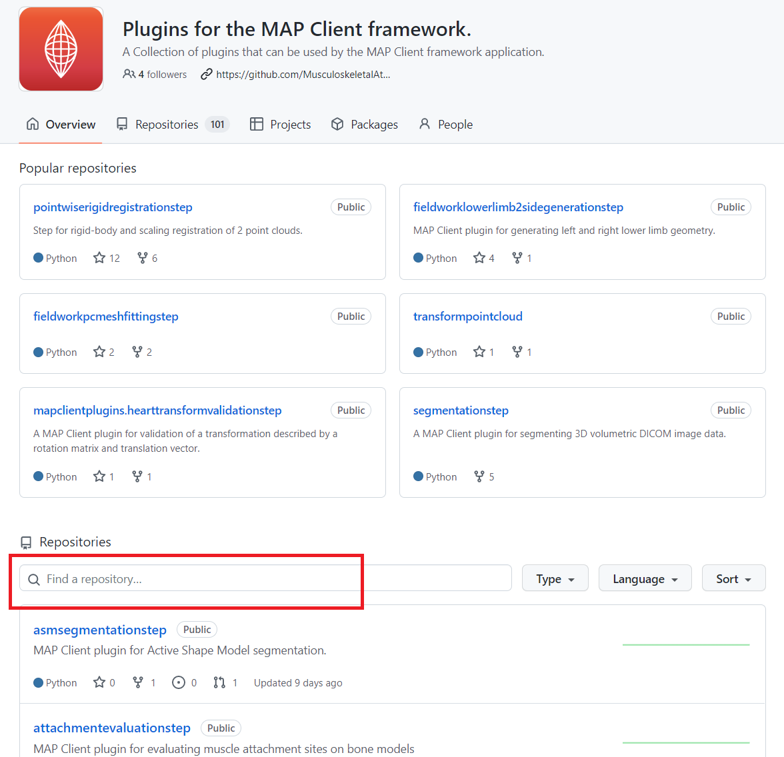
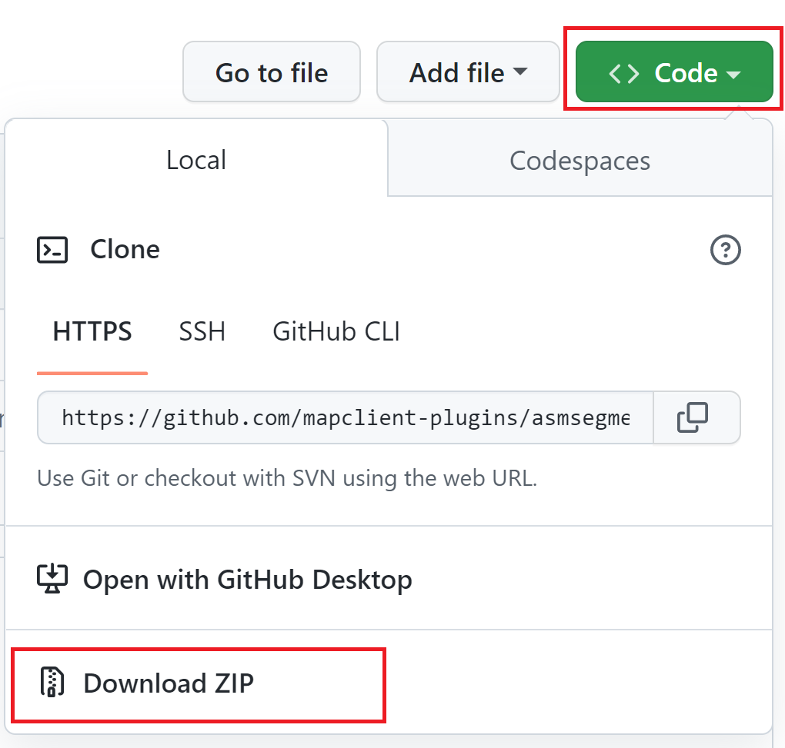

==========================
Install MAP Client Plugins
==========================

.. _github orginisation: https://github.com/mapclient-plugins

This section will describe the basic steps of where to find and how to install plugins.
More info on each individual plugin can be found in :doc:`Plugins</plugins/index>` section.

The installation of external MAP Client plugins is a two step process.
The first step is to download the plugins onto the local file system, 
the second step is to use the :ref:`MAP plugin manager <MAP-plugin-manager-tool>` tool to 
identify the plugins and load them into the MAP Client.

Download plugins
----------------

If you installed MAP Client using :ref:`MAP plugin Pre-Built Binary <MAP-Pre-Built-Install>` you get everything you need, however you can only use plugins that have all the dependencies already available to the binary. At this time you cannot add dependencies that a new plugin may or may not require to work.

If you want to install new plugins.
There is a `github orginisation`_ which has a collection of MAP Client plugins.

   Search plugins in GitHub orginisation.

Search the plugin you need and go to the plugin repository page.

   Download plugin source code.

On the repository page, click the green code button and download the source code.
If you are a developer, you can download the source code anyway you like.
If you don't have git in your environment, you can simply click "Download Zip" to download the source code and unzip it.

You also can create your own plugins, the :ref:`MAP plugin wizard <MAP-plugin-wizard>` can help you generated a skeleton step.

Load plugins
------------
To load these plugins we will use the Plugin Manager tool.  
The Plugin Manager tool can be found under the Tools menu.  
Use the Plugin Manager to add the directory location of the MAP plugins. 
After confirming the changes to the Plugin Manager you should see a few new additions to the Step box. 

.. figure:: images/plugin_manager_2.png
   :align: center
   :width: 50%

   Plugin Manager Tool

The plugin tool is a simple tool that enables the user to add or remove additional plugin directories.
When first opened, the MAP Client will not have any plugins installed and the plugin directories list (2) will be empty.
New plugin directories can be added with the *Add Directory* button (1).
Directories are removed by selecting the desired directory in the plugin directories list (2) and clicking the *Remove Directory* button (3).
After making any changes to the plugin directories list (2), you can apply these changes by choosing either *Apply* (4) or *OK* (5).
If you make any changes to the directory list (2) but click *Close* before choosing *Apply* or *OK*, the changes will not be saved.
Outdated plugins can also be updated using the *Advanced* dialog (6).

.. note::

 The *Apply* button (4) does not apply directory removals (3).
 You will need to restart the MAP Client to ensure that the plugins are completely removed from the MAP *Step Box*.
 This behaviour is a side-effect of the Python programming language.

Additional Resources
--------------------

:doc:`MAP Plugins <../manual/MAP-plugin>`

:doc:`MAP Tutorial - Create Plugin <../manual/MAP-tutorial-plugin>`

