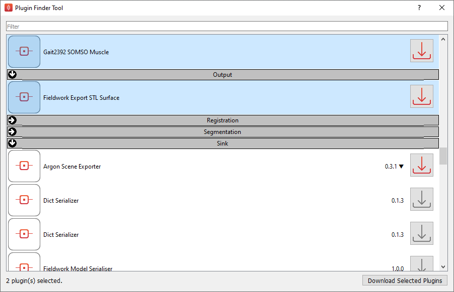
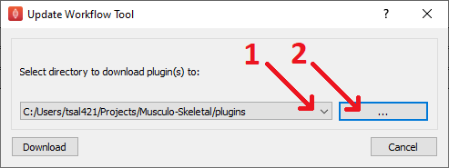
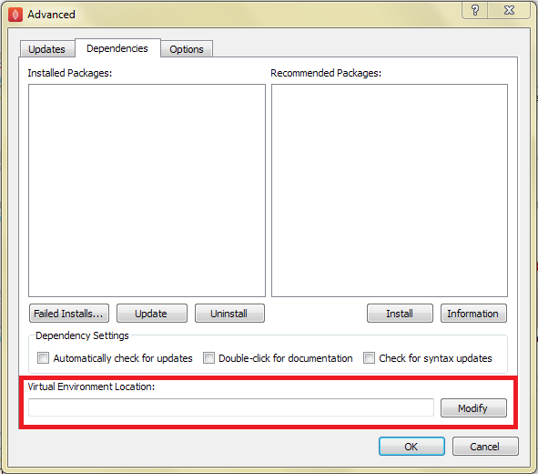

.. _MAP-feature-demonstration:

==========================
MAP Features Demonstration
==========================

.. sectionauthor:: Hugh Sorby

.. _MAP: https://simtk.org/home/map
.. _physiome: http://physiomeproject.org/zinclibrary
.. _project downloads: https://github.com/MusculoskeletalAtlasProject/mapclient/releases
.. _read-the-docs: http://abibook.readthedocs.org/en/latest/PMR/index.html
.. _MAP Plugin Database: https://github.com/MusculoskeletalAtlasProject/map-plugin-database

This document details the features of `MAP`_ - a cross-platform framework for managing workflows.
MAP is a plugin-based application that can be used to create workflows from a collection of workflow steps.

This demonstration is based on version 0.16.0 of the MAP Client, available from `project downloads`_.
Directions for installing MAP and getting the MAP plugins are available in the :ref:`MAP-install-setup`.

In this demonstration we will cover the features of the MAP Client.
We will start with a quick tour and then create a new workflow that will help us segment a region of interest from a stack of images.

Quick Tour
==========

When you first load MAP, it will look something like this:

.. figure:: images/map_client_gui.png
   :align: center
   :width: 75%

In the main window we can see three distinct areas that make up the workflow management side of the software.
These three areas are the menu bar (at the top), the step box (on the left) that contains the steps that you can use to create your workflow and the workflow canvas (on the right) an area for constructing a workflow.

When you first run the MAP Client, you will notice that there aren't any plugins in the step box area.
This is because we haven't yet loaded any external plugins for the MAP Client to use.

Menu Bar
--------

The Menu bar provides a selection of drop down menus for accessing the application's functions.
The *File* menu provides options for opening, importing and closing workspaces as well as quitting the application.
The *Edit* menu provides access to the undo/redo functionality.
The *View* menu provides access to the application's log entries.
The *Tools* menu provides access to the Plugin Manager tool, Physiome Model Repository (PMR) tool and the Annotation tool.
The *Help* menu provides access to the *About* box which contains information on contributors and the license that the MAP application is released under.

The *New* menu has two sub-menus: *New/PMR Workflow* and *New/Workflow*.
The *New/PMR Workflow* menu command will create a new workflow in the chosen directory and use Mercurial to track changes to your project.
When saving the workflow the contents of the project will be transferred to PMR via Mercurial, this transfer is managed by the application.
For more information on the benefits and use of PMR please read the documentation available at `read-the-docs`_ .

.. warning::
    PMR support for the MAP Client is currently under development.
    You may encounter unexplained behavior if you attempt to use PMR with MAP Client version 0.16.2 or below.

.. figure:: images/select_workflow_directory_1.png
   :align: center
   :width: 75%

The *New/Workflow* menu command will create a new workflow on your local disk in the selected directory.

Step Box
--------

The Step box provides a selection of steps that are available for the user to construct a workflow from.
The first time we run the MAP Client, the *Step Box* area of the application will be empty.
To add plugins to the application, we must download the desired plugins to our system and use the *Plugin Manager* tool to import them.
For more details on importing new plugins, please follow the setup instructions :ref:`here<MAP-install-setup>`.

Workflow Canvas
---------------

The workflow canvas is where we construct and edit our workflow.
We can add new steps to the workflow by simply dragging the desired plugins from the step box and dropping them on the workflow canvas.
Finally, we add connections between each step to complete the workflow.

When a step is added to the workflow the icon which is visible in the Step box is augmented with visualisations of the Steps ports and the steps configured status.
A description of each step's port will show when the mouse is hovered over them.
The image below shows the *Image Source* step with the annotation for the port displayed.

.. figure:: images/step_with_port_info_displayed_1.png
   :align: center
   :width: 40%
  
Tools
=====

MAP currently has a number of tools that may be used to aide the management of the workflow.
This includes a *Plugin Manager*, *Plugin Finder*, *Package Manager*, *Plugin Wizard*, *Physiome Model Repository (PMR)* tool,
*Rename Plugin* tool, and an *Update Plugin* tool.

The :ref:`Plugin Manager<MAP-plugin-manager-tool>`, :ref:`Plugin Finder<MAP-plugin-finder-tool>`,
:ref:`Physiome Model Repository (PMR)<MAP-PMR-tool>` tool, :ref:`Update Workflow<MAP-update-workflow-tool>` tool and
:ref:`Rename Plugin<MAP-rename-plugin-tool>` tool are described in detail below. The :ref:`Plugin Wizard<MAP-plugin-wizard>` is explained
in its own section later in this manual.

.. _MAP-plugin-manager-tool:

Plugin Manager Tool
-------------------

The plugin tool is a simple tool that enables the user to add or remove additional plugin directories.
When first opened, the MAP Client will not have any plugins installed and the plugin directories list (2) will be empty.
New plugin directories can be added with the *Add Directory* button (1).
Directories are removed by selecting the desired directory in the plugin directories list (2) and clicking the *Remove Directory* button (3).
After making any changes to the plugin directories list (2), you can apply these changes by choosing either *Apply* (4) or *OK* (5).
If you make any changes to the directory list (2) but click *Close* before choosing *Apply* or *OK*, the changes will not be saved.
Outdated plugins can also be updated using the *Advanced* dialog (6).

.. note::

 The *Apply* button (4) does not apply directory removals (3).
 You will need to restart the MAP Client to ensure that the plugins are completely removed from the MAP *Step Box*.
 This behaviour is a side-effect of the Python programming language.

.. figure:: images/plugin_manager_2.png
   :align: center
   :width: 50%

Advanced Dialog
^^^^^^^^^^^^^^^

As a result of forward compatibility issues between Python 2 and Python 3 a number of updates may be required for older plugins to work properly in MAP Client.
The Advanced dialog provides a means of analysing the plugins in the directories listed in the Plugin Manager dialog (1) and applying a range of fixers for syntax, indentation and missing plugin information (2).
Once updates have been successfully applied to plugins the Step Box will update automatically and any plugins requiring additional dependencies will be displayed.
It is recommended that you analyse and update all plugins before continuing with workflow creation.  We have updated all known plugins, those that we have access to on GitHub.
For example, we have updated all the plugins available from the `mapclient-plugins <https://github.com/mapclient-plugins>`__ GitHub organisation to ensure that these compatibility issues are resolved.

Settings related to the Plugin Updater are located under the Options tab (3).
You can toggle which updates you would like to apply to the plugins in your plugin directory (4), examine ignored plugin error notifications (5), add and remove plugin resource filenames from the updater (6) and locate the 2to3.py script in your system (7).

Dependency settings and information can be accessed under the Dependencies tab in the Advanced dialog (8). Here you can examine the list of installed packages in your system (9), update or uninstall these packages (10), view a list of recommended packages for plugin development (11), setup and modify the MAP Client virtual environment (12), view a list of packages that failed to install on your system (13) and modify setttings associated with package documentation and syntax analysis of dependencies (14). 

Plugin Updates:

.. figure:: images/advanced_dialog.png
   :align: center
   :width: 35%

Options tab:

.. figure:: images/options_advanced_dialog.png
   :align: center
   :width: 35%

Dependencies tab:

.. figure:: images/dependencies_tab.png
   :align: center
   :width: 35%

.. _MAP-plugin-finder-tool:

Plugin Finder Tool
------------------

This tool makes use of the `MAP Plugin Database`_ to present the MAP-Client user with a complete list of all the known, published MAP-Client plugins.
Further information about the maintenance of this database, as well as how MAP-Client users may submit their own plugins for addition to this database can be found in the README file for the `MAP Plugin Database`_ repository.

The Plugin Finder tool gives the MAP-Client user the ability to search for MAP plugins by name or by category and allows them to download these plugins directly into one of their MAP-Client plugin directories with the click of a button.
The tool also supports the ability to select and download multiple MAP-Client plugins simultaneously.
The Plugin Finder checks the user's MAP-Client plugin directories for any plugins that are already installed locally.
If the user already has a version installed for a particular plugin, the currently installed version number will be displayed along side the corresponding plugin in the Plugin Finder window.
The tool will also indicate if each installed plugin is up-to-date or if it has a newer version available.
The download button is disabled only if the version number of the plugin that the user has installed matches the most recent release version for that plugin.
It is possible to overwrite/update outdated MAP plugin versions that the user has installed locally, in this case the user will be given a warning to make sure they understand that they may be overwriting any local development changes currently in progress on the outdated plugin version.

On clicking the download button, the MAP-Client user will be given the option to choose a directory to download the plugin(s) into.
By default, the combo-box (1) will be populated with the user's recognised MAP-Client plugin directories.
They may choose to download the plugin(s) into one of these directories or to use a File Dialog (2) to select a new directory to download into.
If the user chooses to download to a directory that is not already connected with the MAP-Client, they will be automatically prompted with the option to add the download directory as a recognized MAP-Client plugin directory.

The Plugin Finder tool utilizes the GitHub API to retrieve the database from the remote repository.
In the unlikely event that the user reaches the GitHub API rate limit (60 requests per hour) they will be prompted to provide a GitHub Personal Access Token.
A copy of the plugin database is cached locally upon retrieval, further decreasing the chances of actually reaching the API rate limit.

.. _MAP-update-workflow-tool:

Update Workflow Tool
--------------------

MAP Client workflows that have been saved in an earlier version of MAP Client to that which the user is currently running, may need to be updated.
The *Update Workflow* tool is intended to simplify the updating process.
To use the update workflow tool, the user need only identify the local directory, use (1) for choosing a workflow directory, of the workflow configuration and click *Update* (2).

.. _MAP-rename-plugin-tool:

Rename Plugin Tool
------------------

The *Rename Plugin* tool can be used to rename MAP Client plugin *step-names* or *package-names* without the user having to edit the plugin's source code.
The user can identify the desired plugin by supplying its root (top-most) directory in the location text box (1), or by using the tool's directory chooser (2).
In the *to step name* box (3) set the new name of the step and in the *to step package name* box (4) set the new package name of the step.
To rename the plugin press the *rename* button (5).

.. _MAP-PMR-tool:

Physiome Model Repository (PMR) Tool
------------------------------------

The PMR tool uses webservices and OAuth to communicate between itself (the consumer) and the PMR website (the server).
Using this tool we can search for and find suitable resources on PMR.

The PMR website uses OAuth to authenticate a consumer and determine consumer access privileges.
Here we will discuss the parts of OAuth that are relevant to getting you (the user) able to access resources on PMR.
Please read the section `Simplified OAuth Primer`_ for a quick overview of OAuth authentication.

If you want the PMR tool to have access to privileged information (your non-public workspaces stored on PMR) you will need to register the PMR tool with the PMR website.
We do this by clicking on the `register` link as shown in the figure below.
This does two things: it shows the Application Authorisation dialog; opens a webbrowser at the PMR website.
[If you are not logged on at the PMR website you will need to do so now to continue, instructions on obtaining a PMR account are available here XXXXX].  On the PMR website you are asked to either accept or deny access to the PMR tool.
If you allow access then the website will display a temporary access token that you will need to copy and paste into the Application Authorisation dialog so that the PMR tool can get the permanent access token.

.. figure:: images/pmr_tool_1.png
   :align: center
   :width: 25%

Simplified OAuth Primer
^^^^^^^^^^^^^^^^^^^^^^^

In OAuth we have three players the server, the consumer and the user.
The server is providing a service that the consumer wishes to use.
It is up to the user to allow the consumer access to the servers resources and set the level of access to the resource.
For the the consumer to access privileged information of the user stored on the server the user must register the consumer with the server, this is done by the user giving the consumer a temporary access token.
This temporary access token is then used by the consumer to finalise the transaction and acquire a permanent access token.
The user can deny the consumer access at anytime by logging into the server and revoking the permanent access token.

Annotation Tool
---------------

.. note::

   Please note that the annotation tool is currently under development, this tool in it's current form as documented here does not integrate well with the latest version of PMR.  This version of the annotation tool has been marked as deprecated and is currently disabled.

The Annotation tool is a very simple tool to help a user annotate the Workflow itself and the Step data directories that are linked to PMR.  At this stage there is a limited vocabulary that the Annotation tool knows about, but this is intended to be extended in coming releases.  The vocabulary that the annotation is aware of is available in the three combo-boxes near the top of the dialog.

.. figure:: images/top_annotation_1.png
   :align: center
   :width: 40%

The main part of the Annotation tool shows the current annotation from the current target.  

.. figure:: images/main_annotation_1.png
   :align: center
   :width: 25%

In the above image we can see the list of annotations that have been added to the current target.  This is a simplified view of the annotation with the prefix of the terms removed for clarity.

Additional Features
===================

Log Information Window
----------------------

The Log Information window displays the application logs for the current session.
This includes information about plugin loading, plugin updates, http requests and general successful or failed processes executed by the program.
Each log is defined by a level (DEBUG, INFO, WARNING, ERROR or CRITICAL) and contains a description and a recorded time.
Logs are displayed in chronological order and can be sorted according to *Level*, *Time* or *Description* (3).
If you wish to access more detailed information about an individual log simply double-click on a log entry or click the *Details* button (2).
This displays the file from which the log was made in addition to the information described previously.
It is also possible to load the log information from a previous MAP Client session using the Load button (1).
The Log Information window provides useful debugging information and should be accessed on a regular basis.

.. figure:: images/log_information.png
   :align: center
   :width: 50%

Plugin Dependencies and Package Installation
--------------------------------------------

Plugin developers may use additional packages in their plugins which are not available within the native python environment. These packages may however be installed using pip (Pip Installs Packages). If your system does not have a package required to run a plugin (and hence any workflow that uses the plugin) it can be installed with pip in the MAP Client virtual python environment. This virtual environment can be set up manually (from the Advanced dialog (2)) or automatically when a package is first required (3). By default the virtual environment will be set up in the same system location as the MAP Client log files, however this may be changed using the Modify button under the Dependencies tab in the Advanced dialog (1).

.. figure:: images/modify-ve.png
    :align: center
    :width: 50%

.. figure:: images/setup-ve.png
    :align: center
    :width: 50%

.. figure:: images/automatic-ve-setup.png
    :align: center
    :width: 40%

