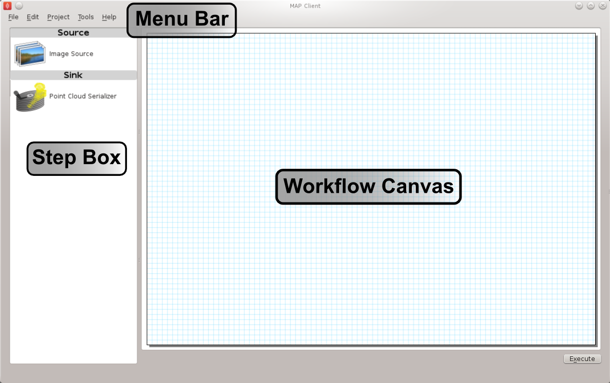
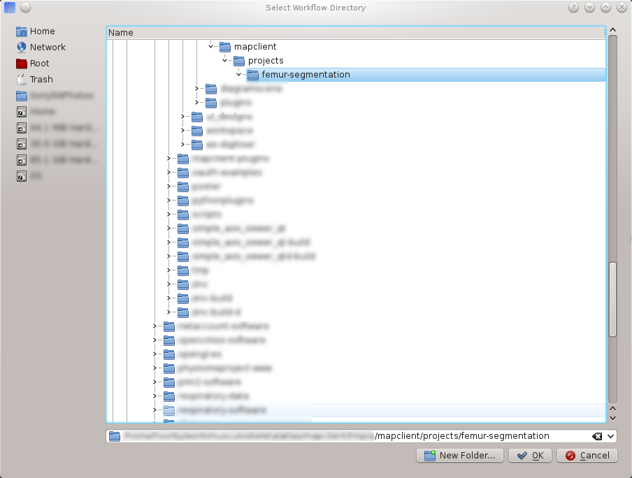
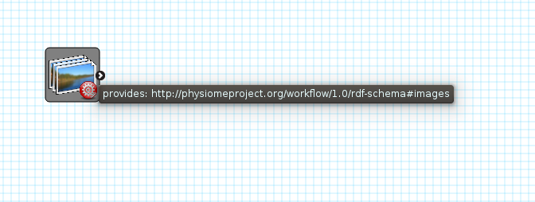
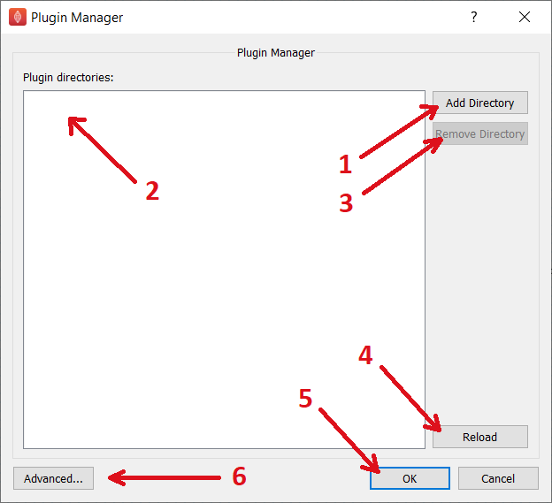
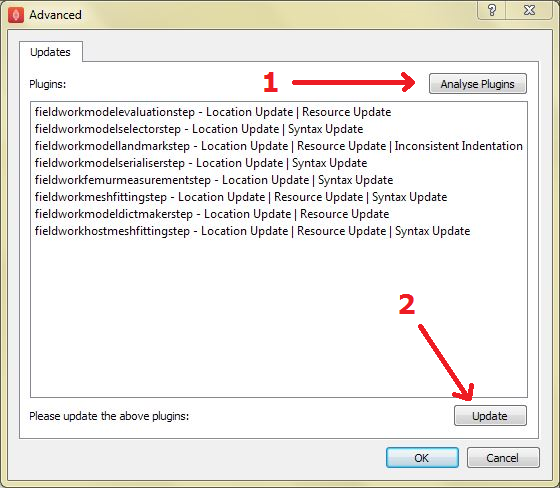
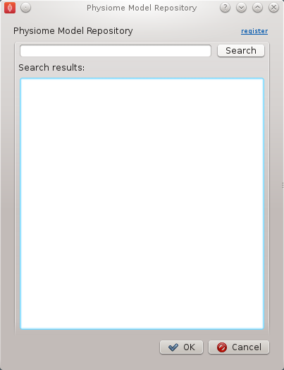
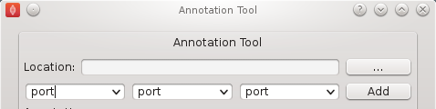
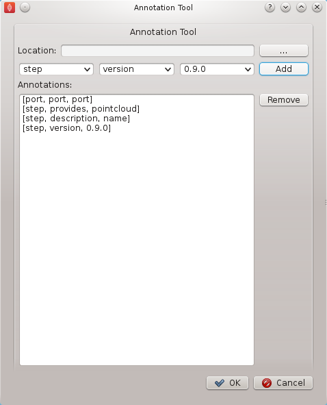
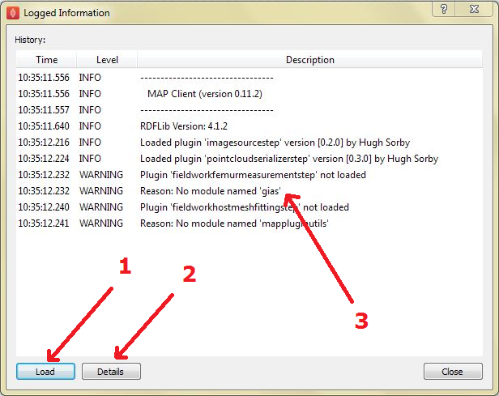

.. _MAP-feature-demonstration:

==========================
MAP Features Demonstration
==========================

.. sectionauthor:: Hugh Sorby

.. _MAP: https://simtk.org/home/map
.. _launchpad project: http://launchpad.net/mapclient
.. _physiome: http://physiomeproject.org/zinclibrary
.. _project downloads: https://launchpad.net/mapclient/+download
.. _read-the-docs: http://abibook.readthedocs.org/en/latest/PMR/index.html

.. note::
   `MAP`_ is currently under active development, and this document will be updated to reflect any changes to the software or new features that are added. You can follow the development of MAP at the `launchpad project`_.

This document details the features of `MAP`_, a cross-platform framework for managing workflows. MAP is a plugin-based application that can be used to create workflows from a collection of workflow steps.

In this demonstration is based on version 0.9.0 of MAP, available from the `project downloads`_. Directions for installing MAP and getting the MAP plugins are available in the :ref:`MAP-install-setup`.

In this demonstration we will cover the features of MAP.  We will start with a quick tour and then create a new workflow that will help us segment a region of interest from a stack of images.

Quick Tour
==========

When you first load MAP, it will look something like this:

In the main window we can see three distinct areas that make up the workflow management side of the software.  These three areas are the menu bar (at the top), the step box (on the left) that contains the steps that you can use to create your workflow and the workflow canvas (on the right) an area for constructing a workflow.

In the Step box we will only see two steps, this is because we have only loaded the default Steps and not loaded any of the external plugins that MAP can use.

Menu Bar
--------

The Menu bar provides a selection of drop down menus for accessing the applications functions.  The File menu provides access to opening, importing, closing workspaces as well as quitting the application.  The Edit menu provides access to the undo/redo functionality.  The View menu provides access to the application's log entries.  The Tools menu provides access to the Plugin Manager tool, Physiome Model Repository (PMR) tool and the Annotation tool.  The Help menu provides access to the about box which contains information on contributors and the license that the MAP application is released under.

The 'New' menu has two sub-menus: 'New/PMR Workflow' and 'New/Workflow'.  The PMR Workflow menu command will create a new workflow in the chosen directory and use Mercurial to track changes to your project.  When saving the workflow the contents of the project will be transferred to PMR via Mercurial, this transfer is managed by the application.  For more information on the benefits and use of PMR please read the documentation available at `read-the-docs`_ .

The Workflow menu command will create a new workflow on your local disk in the selected directory.

Step Box
--------

The Step box provides a selection of steps that are available to construct a workflow from.  The first time we start the program only the default plugins are available.  To add more steps we can use the Plugin Manager tool.  To use a step in our workflow we drag the desired step from the step box onto the workflow canvas.

Workflow Canvas
---------------

The workflow canvas is where we construct and edit our workflow.  We do this by adding the steps to the workflow canvas from the step box that make up our workflow.  We then make connections between the workflow steps to define the complete workflow.

When a step is added to the workflow the icon which is visible in the Step box is augmented with visualisations of the Steps ports and the steps configured status.  The annotation of the steps ports will show when the mouse is hovered over a port.  The image below shows the Image Source step with the annotation for the port displayed.

  
Tools
=====

MAP currently has three tools that may be used to aide the management of the workflow.  They are the Plugin Manager tool, the Physiome Model Repository (PMR) tool and the Annotation tool.  For a description of each tool see the relevant sections.

.. _MAP-plugin-manager-tool:

Plugin Manager Tool
-------------------

The plugin tool is a simple tool that enables the user to add or remove additional plugin directories.  MAP comes with some default plugins which the user can decide to load or not by checking or unchecking the check box (1) at the bottom of the dialog.  External directories are added with the add directory button (2).  Directories are removed by selecting the required directory in the Plugin directories list (3) and clicking the remove directory button (4).  To reload plugins from the current plugin directories use the reload button (5).  Outdated plugins can also be updated using the Advanced dialog (7).

.. note::

 The reload will only reload the plugins from the current plugin directories, this will not include any changes to the directories in the current dialog.  To confirm changes and load plugins from the plugin directories listed in the plugin manager click the OK button (6).

Whilst additions to the plugin path will be visible immediately in the Step box deletions will not be apparent until the next time the MAP Client is started.  This behaviour is a side-effect of the Python programming language.

Advanced Dialog
^^^^^^^^^^^^^^^

As a result of forward compatibility issues between Python 2 and Python 3 a number of updates may be required for older plugins to work properly in MAP Client.  The Advanced dialog provides a means of analysing the plugins in the directories listed in the Plugin Manager dialog (1) and applying a range of fixers for syntax, indentation and missing plugin information (2).  Once updates have been successfully applied to plugins the Step Box will update automatically and any plugins requiring additional dependencies will be displayed. It is recommended that you analyse and update all plugins before continuing with workflow creation.  We are currently updating all available plugins on the 'mapclient-plugins' GitHub repository to ensure that these compatibility issues are resolved.

Physiome Model Repository (PMR) Tool
------------------------------------

The PMR tool uses webservices and OAuth to communicate between itself (the consumer) and the PMR website (the server).  Using this tool we can search for and find suitable resources on PMR.

The PMR website uses OAuth to authenticate a consumer and determine consumer access privileges.  Here we will discuss the parts of OAuth that are relevant to getting you (the user) able to access resources on PMR.  Please read the section `Simplified OAuth Primer`_ for a quick overview of OAuth authentication.

If you want the PMR tool to have access to privileged information (your non-public workspaces stored on PMR) you will need to register the PMR tool with the PMR website.  We do this by clicking on the `register` link as shown in the figure below.  This does two things: it shows the Application Authorisation dialog; opens a webbrowser at the PMR website.  [If you are not logged on at the PMR website you will need to do so now to continue, instructions on obtaining a PMR account are available here XXXXX].  On the PMR website you are asked to either accept or deny access to the PMR tool.  If you allow access then the website will display a temporary access token that you will need to copy and paste into the Application Authorisation dialog so that the PMR tool can get the permanent access token.

Simplified OAuth Primer
^^^^^^^^^^^^^^^^^^^^^^^

In OAuth we have three players the server, the consumer and the user.  The server is providing a service that the consumer wishes to use.  It is up to the user to allow the consumer access to the servers resources and set the level of access to the resource.  For the the consumer to access privileged information of the user stored on the server the user must register the consumer with the server, this is done by the user giving the consumer a temporary access token.  This temporary access token is then used by the consumer to finalise the transaction and acquire a permanent access token.  The user can deny the consumer access at anytime by logging into the server and revoking the permanent access token.

Annotation Tool
---------------

.. note::

   Please note that the annotation tool is currently under development, this tool in it's current form as documented here does not integrate well with the latest version of PMR.  This version of the annotation tool has been marked as deprecated

The Annotation tool is a very simple tool to help a user annotate the Workflow itself and the Step data directories that are linked to PMR.  At this stage there is a limited vocabulary that the Annotation tool knows about, but this is intended to be extended in coming releases.  The vocabulary that the annotation is aware of is available in the three combo-boxes near the top of the dialog.

The main part of the Annotation tool shows the current annotation from the current target.  

In the above image we can see the list of annotations that have been added to the current target.  This is a simplified view of the annotation with the prefix of the terms removed for clarity.

Additional Features
===================

Log Information Window
----------------------

The Log Information window displays the application logs for the current session.  This includes information about plugin loading, plugin updates, http requests and general successful or failed processes executed by the program.  Each log is defined by a level (DEBUG, INFO, WARNING, ERROR or CRITICAL) and contains a description and a recorded time.  Logs are displayed in chronological order and can be sorted according to level, time or description(3).  If you wish to access more detailed information about an individual log simply double-click on a log entry or click the Details button (2).  This displays the file from which the log was made in addition to the information described previously. It is also possible to load the log information from a previous MAP Client session using the Load button (1). The Log Information window provides useful debugging information and should be accessed on a regular basis.

