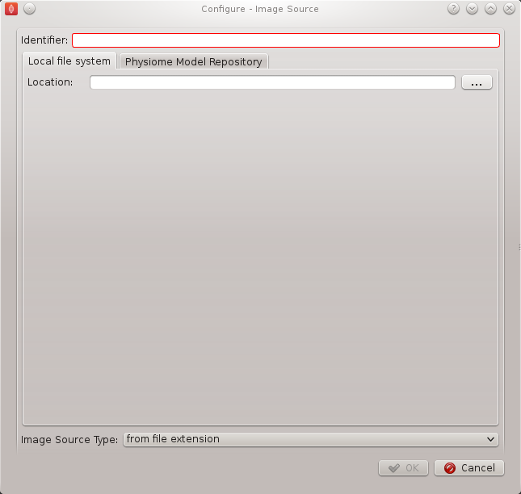
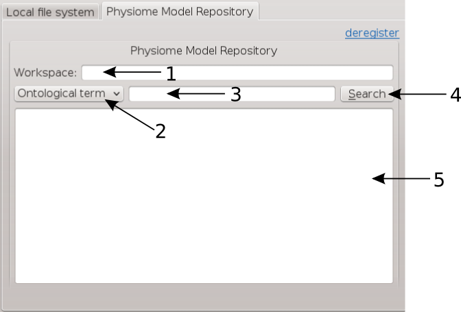
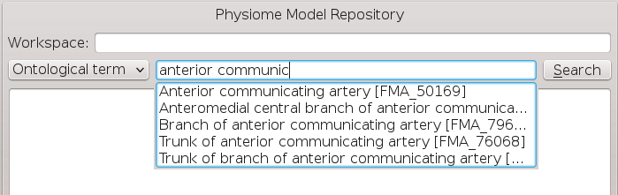
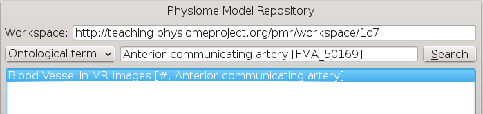
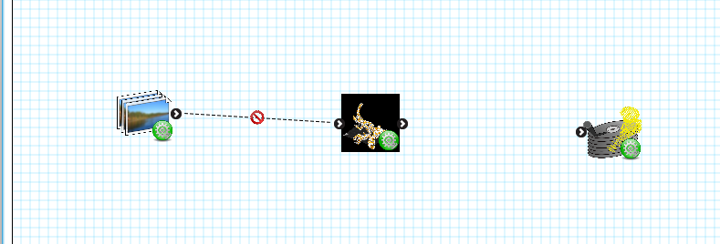

.. _MAP-tutorial-create:

==============================
MAP Tutorial - Create Workflow
==============================

.. sectionauthor:: Hugh Sorby

.. _launchpad project: http://launchpad.net/mapclient
.. _MAP: https://simtk.org/home/map

.. note::
   `MAP`_ is currently under active development, and this document will be updated to reflect any changes to the software or new features that are added. You can follow the development of MAP at the `launchpad project`_.

This document details takes the reader through the process of creating a workflow from existing MAP plugins.  Having a read through the :doc:`MAP-feature-demonstration` is a good way to become familiar with the features of the MAP application.

Getting Started
===============

To get started with MAP we need to create a new workflow.  To do this we use File -> New -> Workflow menu option (Ctrl-N shortcut).  This option will present the user with a directory selection dialog.  Use the dialog to select a directory where the workflow can be saved.  Once we have chosen a directory the step box and workflow canvas will become enabled.

To create a meaningful workflow we will need to use some external plugins.  To load these plugins we will use the Plugin Manager tool.  The Plugin Manager tool can be found under the Tools menu.  Use the Plugin Manager to add the directory location of the MAP plugins. After confirming the changes to the Plugin Manager you should see a few new additions to the Step box. 

Creating the Workflow
=====================

To create a workflow we use Drag 'n' Drop to drag steps from the Step box and drop the step onto the workflow canvas.  When steps are first dropped onto the canvas they show a red gear icon to indicate that the step is not configured.  At a minimum a step requires an identifier to be set before it can be used.
 
Drag the steps `Image Source`, `Data Store` and `Automatic Segmenter` onto the workflow canvas.  All the steps will show a red gear, except the 'Automatic Segmenter' step, this red gear icon indicates that the step needs to be configured.  To configure a step we can either right click on the step to bring up a context menu from which the configure action can be chosen or simply click the red gear directly.  See the relevant section for the configuration of a particular step.

.. note::
  When configuring a step you are asked to set an identifier.  The identifier you set must unique within the workflow and it must not start with a '.'.

Configuring the Image Source Step
---------------------------------

The image source step requires a unique identifier for the step to be set.  It also requires either a location on the local disk where the image data is located or a PMR workspace url from which the image data may be downloaded.  Here we will show how to configure the Image Source step with images that have been stored in a workspace on PMR.

This step requires a unique id to be manually set.  The id is used to create a file containing the step configuration information.  This id for the Image Source step is also used to create a default directory under the workflow project directory if required.  Once a valid identifier is entered the red highlight around the edit box will disappear.

This step configuration makes use of the PMR search widget which gives us the ability to search available workspaces on PMR.  In the image source step configuration dialog seen in `Figure 1`_ we can see that there is a place to set a unique identifier for the step and also two tabs, one tab is for setting the image dataset location on the local disk and the other tab is for searching PMR workspaces for image data.  We will leave the local disk edit box on the local file system tab empty and allow the configuration to set the default location for us.

.. _`Figure 1`:

   
   **Figure 1**: Image source step configuration dialog.

Set the identifer edit box to bv_images and select the Physiome Model Repository tab so that we can search PMR for our images.  On this tab we see 
We are going to conduct an ontological term [**2**] search for our images, we are looking for some images that show an anyeurism in the anterior communicating artery.  To do this we can start entering the text anterior communicating artery into the search term edit box [**3**], when we pause in our typing the dialog will query the PMR OWL terms for suitable matches.  We will see results similar to what is shown in `Figure 3`_, we can click on the matching term in this list and the correct reference will be added to the search term edit box [**3**] for us.

.. _`Figure 2`:

   
   **Figure 2**: PMR search tab, [**1**] Workspace url, [**2**] Search type combobox, [**3**] Search term, [**4**] Search button, [**5**] Search results.

.. _`Figure 3`:

   
   **Figure 3**: PMR OWL terms.

With the correct term in place we can click the search button to return matching results from PMR.  We will get back a single result Blood Vessel in MR Images.  When we select this result in the search results list [**5**] the url for the workspace will be loaded into the workspace url edit box [**1**].  We should now have the dialog looking similar to `Figure 4`_.

.. _`Figure 4`:

   
   **Figure 4**: Completed Physiome Model Repository search tab.

This completes the configuration of the image source step.  When we click Ok in the dialog the images will be downloaded to the default directory on our local disk.

We can also use the combobox at the bottom of the dialog (`Figure 1`_) to set the image type however this is only necessary if the image type cannot be determined through the filename extension.  In our case we can leave this as it is.

MAP is not setup to work with streamed resources so we must download the workspace from PMR to our local disk.

.. note::
   If you do not have all of the plugins required to run the workflow being imported from PMR to your machine you will be prompted to download and install these to a directory. Please ensure you either (1) select a directory that is currently listed in the Plugin Manager Tool or alternatively (2) download to a new directory and add this to the listed directories in the Plugin Manager.

Configuring the Point Cloud Step
--------------------------------

Configuring the Point Cloud step is trivial at this time.  This is because the step only requires an identifier to be set.  The identifier will be used to create a directory where the received point cloud will be serialized.

Executing the Workflow
======================

At this point you should have a workflow area looking like this:

.. figure:: images/configured_MAP_1.png
   :align: center
   :width: 75%

Once the All the steps in the workflow are configured (i.e. no more red gear icons) we can make connections between the steps.  To make a connection between two steps the first step must provide what the second step uses.  When trying to connect two steps that cannot be connected you will see a no entry icon over the connection for a short period of time and then the connection will be removed.  The following image shows an incorrect connection trying to be made.

If the mouse is hovered over a port you will see a description of what the port provides or uses.  To make a connection click on a port and drag the mouse to the port to be connected. 

To execute the workflow we need to connect up the steps in the correct manner and save the workflow.  The workflow should be connected up as can be seen in the following image.

.. figure:: images/connected_MAP_1.png
   :align: center
   :width: 75%

Once the workflow has been saved the execute button in the lower left corner should become enabled.  Clicking the execute button will, naturally enough, execute the workflow step by step.

.. note::
  We can make connections between steps at anytime not just when all steps have been properly configured.
  
Automatic Segmenter Step
------------------------

The 'Automatic Segmenter' actually allows us to interact with executing workflow.  With this step we can move the image plane up and down and change the visibility of the graphical items in the scene.  The image plane is moved through the use of the slider on the left hand side.  The visibility of the graphical items is controlled by checking or unchecking the relevant check boxes.  To continue execution of the workflow click the Done button in the lower right hand corner.
