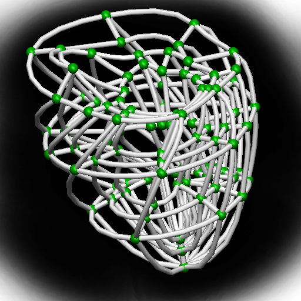
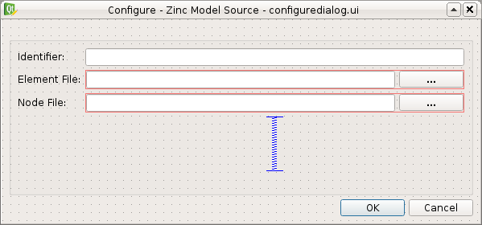

.. _MAP-tutorial-plugin:

============================
MAP Tutorial - Create Plugin
============================

.. sectionauthor:: Hugh Sorby

.. _launchpad project: http://launchpad.net/mapclient
.. _MAP: https://simtk.org/home/map

.. note::
   `MAP`_ is currently under active development, and this document will be updated to reflect any changes to the software or new features that are added. You can follow the development of MAP at the `launchpad project`_.

This document details takes the reader through the process of creating a new plugin for the MAP Client.  The :doc:`MAP-plugin` document defines the plugin interface that the new plugin must adhere to.

A Simple Source Step Example
============================

In this example we will create a source step for supplying Zinc model files.  There are six steps we will need to complete, and they are:

 #. `Modifying the Skeleton Step`_
 #. `Creating an Icon`_
 #. `Defining the Port`_
 #. `Identification`_
 #. `Serialization`_
 #. `Configuration`_

Modifying the Skeleton Step
---------------------------

We could start from scratch and create everything but our task is made a little easier by the presence of the skeleton step.  The skeleton step is a step in it's own right, but it is not useful.  Our task here is to take the skeleton step and rename it to provide the starting point for our new step.

To start with copy the skeletonstep directory to another directory.  To make this step our own we change all occurrences of the skeletonstep name to zincmodelsourcestep.  The places we have to change are:

 #. The topmost directory name
 #. The inner directory name, this directory is used to namespace our new step.
 #. In __init__.py file in the topmost directory, we also need to uncomment the lines::

     from zincmodelsourcestep import step
     print("Plugin '{0}' version {1} by {2} loaded".format(tail, __version__, __author__))
     
 #. In __init__.py file in the inner directory.  We have to change the name of the class to 'ZincModelSourceStep' and change the name of the step to 'Zinc Model Source'.
 
I will refer to the topmost directory as the 'step root' directory for the remainder of this example. 

Creating an Icon
----------------

Creating an icon is optional as a default icon is provided, however it is nice to see your own icona and visually differentiate it from the other steps in the framework.
 
The are an all many of ways to create an icon to represent our step in the MAP application.  So I will leave this as an exercise for the reader.

For the purposes of this example I created the icon below using the Gimp image manipulation program and it is available :download:`here <images/zinc_model_icon.png>`.

   
We can use Qt's designer application to create a resource file from which we can generate a Python resource file.  The creation of a resource file in Qt designer is out of the scope of this example but there are numerous demonstrations of how to do this available on the web.

Once the resources file has been created we can generate the Python version of this file like so::

  pyside-rcc -py3 -o resources_rc.py qt/resources.qrc
  
A few things to note:

 #. the current working directory is assumed to be '<step root>/zincmodelsourcestep/widgets' (and it exists).
 #. the qt specific files are saved in a directory called 'qt', which is a subdirectory of the current  working directory.
 #. 'resources_rc' is the default resource file name used by the Python ui compiler, in this particular situation it is not important but just easier to name the generated resource file as the Python ui compiler expects for situations when the resources are needed by the user interface.
 #. the use of the -py3 flag, when creating image resources the presence or lack thereof doesn't make much difference at the end of the day but maintaining compatibility with both Python 2 and Python 3 is desirable.

Defining the Port
-----------------

To make our step useful we need to make it provide/use information for/from another step.  To do this we define a port for the step.  The port is described using Resource Description Framework (RDF) triples.  The MAP application defines the terms 'http://physiomeproject.org/workflow/1.0/rdf-schema#port', ' http://physiomeproject.org/workflow/1.0/rdf-schema#provides' and 'http://physiomeproject.org/workflow/1.0/rdf-schema#uses' among others.  We can use to these terms to interchange information about the port we will create, for this example we are interchanging information between the plugin and the application.  Further we can add this information into the semantic web so that others may search for and utilise it.  While adding information about our step and it's ports into the semantic web is outside of the scope of the current example, it is important to understand the other ways in which we might inform other users and developers of our work.

If we define the term 'http://physiomeproject.org/workflow/1.0/rdf-schema#zincmodeldata' to define our Zinc model data object.  The tacit knowledge we take from this definition is that it is a class derived from a Python object class with three attributes:
 
 #. _identifier
 #. _elementLocation
 #. _nodeLocation

Furthermore the _elementLocation will identify a file resource that defines the elements (and the nodes if _nodeLocation is empty) for the model and the _nodeLocation will identify a file resource that defines the nodes for the model.  The class also has access methods 'elementFile()' and 'nodeFile()' which return a Python string holding the values of the respective attributes.  The Python representation of this definition is given by the ZincModelData class::

  class ZincModelData(object):
      
      def __init__(self):
          self._identifier = ''
          self._elementLocation = ''
          self._nodeLocation = ''
       
      def elementFile(self):
          return self._elementLocation
      
      def nodeFile(self):
          return self._nodeLocation

Identification
--------------

The step needs to be identified, among other things it determines where we deserialise and serialise to as well as being helpful for annotations.  For this example we could simply supply a randomly generated identifier but we will allow the user to define one.  The identifier can be used by the serialization/deserialization methods to store the step state in a file.  Using the step identifier assures the developer that no-one else will write to that file.  This enforces a requirement onto the identifier to be unique within a workflow.

Serialization
-------------

Serialization is the process of translating the object state into a format that can be stored (for example in a file) and later used to reinstate the object to how it was when the serialization took place.  The exact how of the step serialization is up to the step author to decide, the following is just one way to approach this issue.  The state of our step is stored within the ZincModelData object so we need to be able to serialize and deserialize this class.  We will use the QSettings class from the Qt framework to do the serialization and deserialization for us.  In the Step class we add the following two methods::

    def serialize(self, location):
        configuration_file = os.path.join(location, getConfigFilename(self._state._identifier))
        s = QtCore.QSettings(configuration_file, QtCore.QSettings.IniFormat)
        s.beginGroup('state')
        s.setValue('identifier', self._state._identifier)
        s.setValue('element', self._state._elementLocation)
        s.setValue('node', self._state._nodeLocation)
        s.endGroup()
     
    def deserialize(self, location):
        configuration_file = os.path.join(location, getConfigFilename(self._state._identifier))
        s = QtCore.QSettings(configuration_file, QtCore.QSettings.IniFormat)
        s.beginGroup('state')
        self._state._identifier = s.value('identifier', '')
        self._state._elementLocation = s.value('element', '')
        self._state._nodeLocation = s.value('node', '')
        s.endGroup()

The 'location' parameter that is passed into these two methods is the location of the project directory.  The serialization and deserialization write to a file in this directory using the step identifier as the part of the filename.  In this way with the step identifier being unique within the workflow the serialization process won't overwrite (or get overwritten by) another serialization process.

Configuration
-------------

Next we need to enable the user to be able to configure the step.  To do this we can use qt-designer to create a 'configuredialog.ui' file that we can convert into Python code using 'pyside-uic'.  We want the configuredialog.ui to look like this:

  
The Qt designer .ui file for this dialog can be found :download:`here <qt/configuredialog.ui>`.  As it can be seen in the figure above we allow the user to set an identifier for the step and define the location of the element and node file that define the Zinc model.  To generate the Python code from the .ui file execute the following command::

  pyside-uic --from-imports -o ui_configuredialog.py qt/configuredialog.ui
  
Similarly for creating the resources there a couple of things to note:

 #. the current working directory is assumed to be '<step root>/zincmodelsourcestep/widgets' (and it exists).
 #. the .ui file is saved in a directory called 'qt', which is a subdirectory of the current  working directory.
 #. the use of the --from-imports flag for Python 3 compatibility.

Having created the user interface part of the configuration dialog we need to add the Python code to handle the user interaction.  We will use composition of the user interface code rather than multiple-inheritance to combine the user interface code with the user interaction code.  Create a Python module 'configuredialog' in the 'zincmodelsourcestep/widgets' package.  In this module create a class that derives from QtGui.QDialog and sets up the user interface in the __init__ method.  The code should look like this::

  from PySide.QtGui import QDialog
  
  from zincmodelsourcestep.widgets.ui_configuredialog import Ui_ConfigureDialog

  class ConfigureDialog(QDialog):
      '''
      Configure dialog to present the user with the options to configure this step.
      '''

      def __init__(self, state, parent=None):
          '''
          Constructor
          '''
          QDialog.__init__(self, parent)
          self._ui = Ui_ConfigureDialog()
          self._ui.setupUi(self)
        

It can be seen in this code snippet that I am passing in an object using the label 'state' into the constructor of my ConfigureDialog class.  This object is used to represent the state of the ConfigureDialog object for the purposes of serialization and validation.  This object is defined in another Python module called 'zincmodeldata' and contains a class named 'ZincModelData' that has three attributes:

 #. _identifier
 #. _elementLocation
 #. _nodeLocation

This class is used by and returned from two public methods of the ConfigureDialog class setState and getState.  These two methods set the state and get the state of the corresponding user interface elements accordingly.  The implementation of these two methods look like this::

  def setState(self, state):
      self._ui.identifierLineEdit.setText(state._identifier)
      self._ui.elementLineEdit.setText(state._elementLocation)
      self._ui.nodeLineEdit.setText(state._nodeLocation)
    
  def getState(self):
      state = ZincModelData()
      state._identifier = self._ui.identifierLineEdit.text()
      state._elementLocation = self._ui.elementLineEdit.text()
      state._nodeLocation = self._ui.nodeLineEdit.text()
        
      return state

The ConfigureDialog class is also going to help us validate the step configuration.  When we have a valid step we can execute the workflow that uses the step.  So when validating our step we need to ensure that it has everything required for successful execution.  In this case, the requirements are an existing element file.  A node file isn't strictly necessary as it may be incorporated into the element file.

With this in mind we define the 'validate' method of the ConfigureDialog class to return True when we have the location of an existing exelem file and False otherwise.  It is also important to document the condition(s) under which the step is considered valid so that other uses understand the expected behaviour.  The 'validate' method should look like this::

    def validate(self):
        element_filename = self._ui.elementLineEdit.text()
        element_valid = len(element_filename) > 0 and os.path.exists(element_filename)
        
        self._ui.buttonBox.button(QDialogButtonBox.Ok).setEnabled(element_valid)

        return element_valid

By manipulating the state of the 'Ok' button we know that the step is valid when returning from the dialog when the 'Ok' button has been activated.

As far as the ConfigureDialog is concerned all it requires is for the connections between the widget signals and class methods to be defined.  To make the required connections we can create a method called '_makeConnections' which we can call from the constructor and add three supporting methods for handling the responses to user actions.  Here is the code we need to add::

    def _makeConnections(self):
        self._ui.elementButton.clicked.connect(self._elementButtonClicked)
        self._ui.nodeButton.clicked.connect(self._nodeButtonClicked)
        self._ui.elementLineEdit.textChanged.connect(self.validate)

    def _lineEditFile(self, line_edit):
        (fileName, _) = QFileDialog.getOpenFileName(self, 'Select Zinc File') 
        
        if fileName:
            location = os.path.basename(fileName)
            line_edit.setText(fileName)
            
        self.validate()
    
    def _elementButtonClicked(self):
        self._lineEditFile(self._ui.elementLineEdit)
    
    def _nodeButtonClicked(self):
        self._lineEditFile(self._ui.nodeLineEdit)

There are a number of niceties that we have not added into this example code that we could have.  We have also not added any checks to make sure the file selected is an exelem file.  But this fits in with the approach where we consider that TUINAI.

